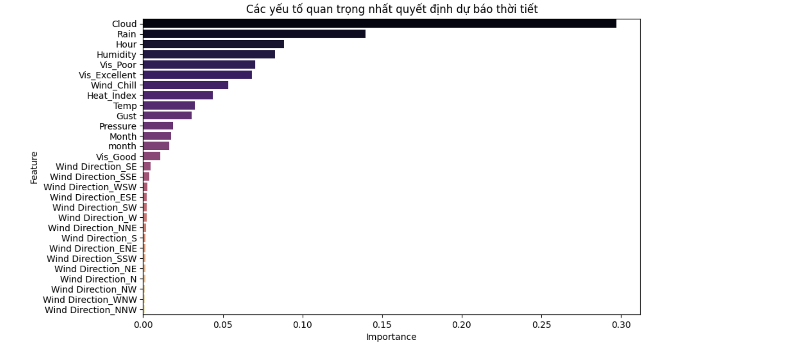

# NCKH-weather-2026
## Tên đề tài

> **Phân tích mối quan hệ giữa nhiệt độ, độ ẩm và lượng mưa tại Thành phố Hồ Chí Minh giai đoạn 2009-2020 bằng mô hình hồi quy tuyến tính.**

---

## Mục tiêu nghiên cứu

- Tổng hợp và phân tích các nghiên cứu liên quan đến mối quan hệ giữa các yếu tố khí tượng.
- Xử lý và chuẩn bị dữ liệu thời tiết lịch sử tại TP. Hồ Chí Minh.
- Xây dựng mô hình hồi quy tuyến tính để phân tích mối quan hệ giữa lượng mưa, nhiệt độ và độ ẩm.
- Đánh giá hiệu suất mô hình bằng các chỉ số thống kê (R², RMSE, p-value).
- Phân tích và diễn giải kết quả nhằm làm rõ mối quan hệ định lượng giữa các biến.
- **Xây dựng mô hình Machine Learning dự báo trạng thái thời tiết.**

---

## Kết quả kỳ vọng

- Mô hình hồi quy tuyến tính đã được kiểm định, phản ánh mối quan hệ giữa nhiệt độ, độ ẩm và lượng mưa tại TP. Hồ Chí Minh.
- Báo cáo đánh giá khả năng ứng dụng của mô hình trong phân tích dữ liệu khí tượng đô thị.
- **Mô hình Random Forest dự báo thời tiết với độ chính xác 92.2%.**

---

## Dữ liệu sử dụng

**Bộ dữ liệu:** *Historical Weather Analysis Data – Ho Chi Minh City*

- **Thời gian:** 2009 - 2020
- **Số lượng mẫu:** ~35,000 quan sát
- **Các biến:** Nhiệt độ, độ ẩm, lượng mưa, áp suất, tốc độ gió, hướng gió, trạng thái thời tiết,...

---

## Phương pháp

### Phương pháp chính
**Mô hình hồi quy tuyến tính đa biến**

### Machine Learning
- Logistic Regression
- Support Vector Machine (SVM)
- **Random Forest** (tốt nhất: 92.2% accuracy)

---

## Exploratory Data Analysis (EDA)

Notebook thực hiện:
- Thống kê mô tả
- Trực quan hóa dữ liệu
- Phân tích giá trị ngoại lai (Outlier)
- Kiểm tra mối quan hệ ban đầu giữa các biến
- Phân tích biến phân loại (Categorical Analysis)
- Phân tích chuỗi thời gian (Time Series)

## Machine Learning - Dự báo trạng thái thời tiết

### Quy trình xử lý dữ liệu

| Bước | Mô tả |
|------|-------|
| 1 | Loại bỏ các cột gây nhiễu (Datetime, Feels, Wind Speed) |
| 2 | Mã hóa nhãn mục tiêu `Weather` bằng `LabelEncoder` |
| 3 | Mã hóa biến phân loại `Vis` và `Wind Direction` |
| 4 | Chia tập dữ liệu: **80% Train / 20% Test** |
| 5 | Chuẩn hóa dữ liệu bằng `StandardScaler` |

**Kết quả sau xử lý:**
- Số mẫu huấn luyện: **27,980**
- Số mẫu kiểm tra: **6,996**
- Số đặc trưng sau encoding: **29**

### Kết quả các mô hình

| Mô hình | Accuracy |
|---------|----------|
| Logistic Regression | 82.89% |
| SVM (RBF Kernel) | 84.02% |
| **Random Forest** | **92.20%**  |

### Random Forest - Chi tiết từng loại thời tiết

| Trạng thái | Precision | Recall | F1-score |
|------------|-----------|--------|----------|
| Clear | 0.94 | 0.97 | 0.95 |
| Cloudy | 0.92 | 0.90 | 0.91 |
| Mist | 1.00 | 1.00 | 1.00 |
| Overcast | 0.97 | 0.97 | 0.97 |
| Rain | 0.95 | 0.89 | 0.92 |
| Sunny | 0.84 | 0.96 | 0.90 |

### Tối ưu hóa Random Forest (GridSearchCV)

**Bộ thông số tốt nhất:**
```python
{
    'class_weight': 'balanced',
    'criterion': 'gini',
    'max_depth': 30,
    'min_samples_split': 2,
    'n_estimators': 300
}

**Kết quả sau tối ưu:**
- Accuracy: **92.15%**
- Cross-validation (5-fold): **92.63% ± 0.31%**

---

### Feature Importance – Yếu tố quan trọng nhất


| Thứ tự | Đặc trưng | Mức độ quan trọng |
|--------|-----------|-------------------|
| 1 | Humidity (Độ ẩm) | ⭐⭐⭐⭐ |
| 2 | Temp (Nhiệt độ) | ⭐⭐⭐⭐ |
| 3 | Pressure (Áp suất) | ⭐⭐⭐ |
| 4 | Heat Index | ⭐⭐⭐ |
| 5 | Cloud (Độ mây) | ⭐⭐⭐ |

> **Độ ẩm là yếu tố quan trọng nhất để dự báo trạng thái thời tiết tại TP. Hồ Chí Minh!**

---

### Kết luận ML

| Tiêu chí | Đánh giá |
|----------|-----------|
| Mô hình tốt nhất | **Random Forest** |
| Độ chính xác | **92.2%** |
| Khả năng ứng dụng |  Cao – dự báo thời tiết theo giờ |

---
